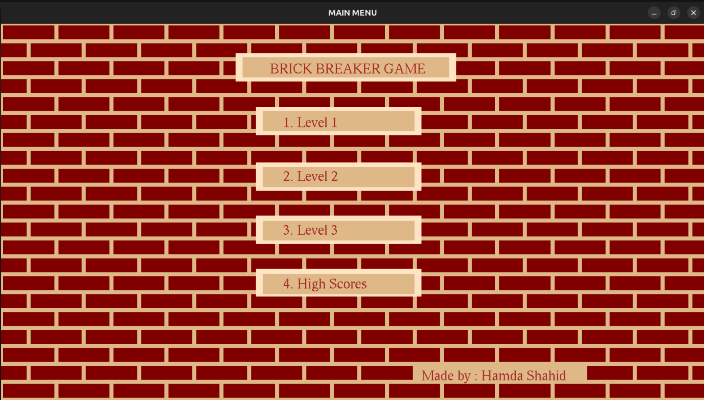
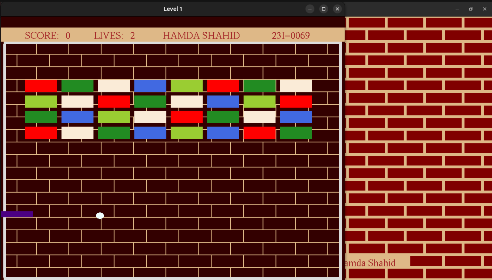
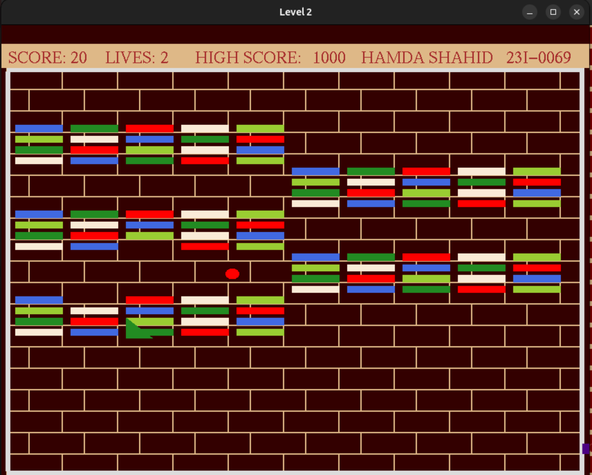
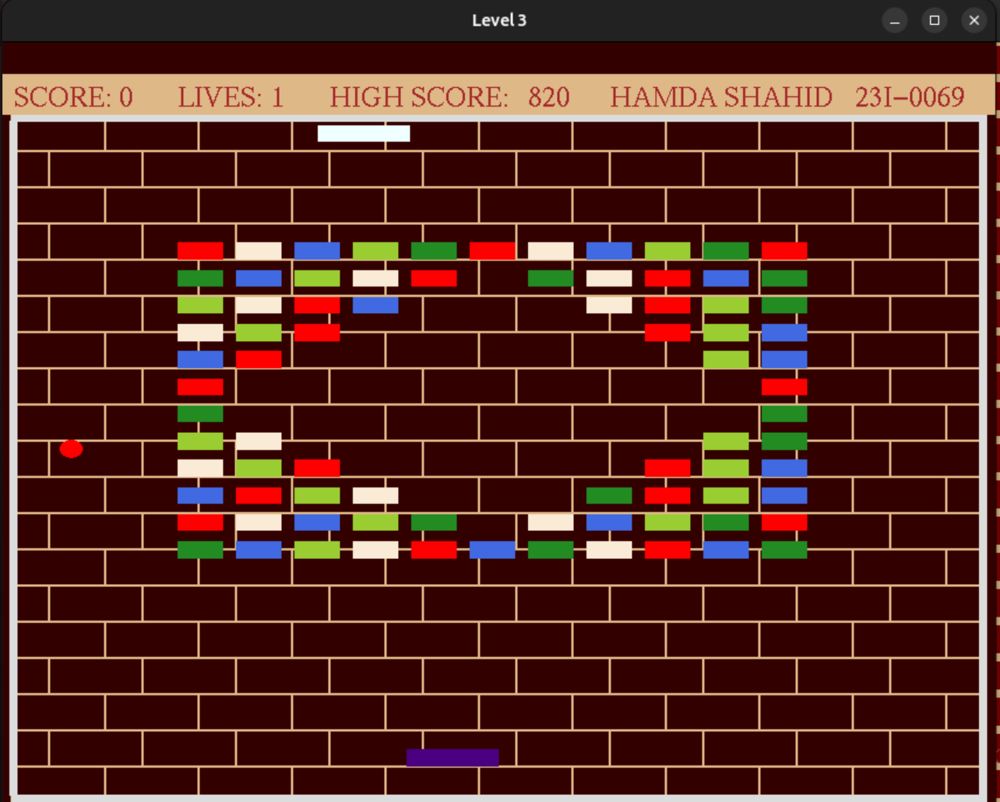

# 🎮 Brick Breaker Game

Welcome to **Brick Breaker Game**, a classic arcade-style game where you break bricks using a paddle and a bouncing ball! Can you beat all levels and become the ultimate champion? 🏆

---

## 🚀 Features

✅ **Multiple Challenging Levels** – Each level introduces new difficulties and surprises!
✅ **Exciting Power-Ups** – Speed boosts, multi-balls, bigger paddles, and more!
✅ **Classic Gameplay** – A modern twist on the legendary brick-breaking game.
✅ **Fun Graphics & Effects** – Enjoy an immersive retro gaming experience.

## 🛠 Installation

1. Clone the repository:
   ```sh
   git clone https://github.com/hamdashahid/Brick_Breaker_Game.git
   ```
2. Navigate to the project folder:
   ```sh
   cd Brick_Breaker_Game
   ```
3. Compile & Run

   - **For C++**:

   1. Compile the game using a C++ compiler:
      ```sh
      make
      ```
   2. Run the game:
      ```sh
      ./game
      ```

4. Enjoy playing! 🎾

---

## 📜 How to Play

1️⃣ **Use the Arrow Keys or Mouse** – Move the paddle left or right to control the ball.
2️⃣ **Hit the Ball** – Prevent the ball from falling by bouncing it off your paddle.
3️⃣ **Break the Bricks** – Aim and hit the ball to destroy all the bricks and clear each level.
4️⃣ **Catch Power-Ups** – Some bricks drop power-ups to help you play better.

💡 **Pro Tip:** Use the paddle’s edges to change the ball’s direction strategically!

## 🕹️ Controls

- **Left Arrow (←) / Right Arrow (→) or Mouse Movement** – Move the paddle left or right.
- **W (←) / R (→)** – Move the paddle left or right.

## 🎯 Features

✔️ Multiple Levels – Increasing difficulty with new challenges!
✔️ Exciting Power-Ups – Grow your paddle, slow down time, and more!
✔️ Classic Gameplay – Enjoy the nostalgic fun of the original Brick Breaker with a modern touch.
✔️ Engaging Visuals – Beautifully designed levels with colorful bricks.

## 🎯 Objective

- Control the paddle to bounce the ball and break all the bricks.
- Complete all levels while scoring the highest points.
- Use power-ups strategically to survive and win.

## 🖥️ Screenshots

### Main Menu



### Level 1



### Level 2



### Level 3 – The Final Challenge!



## 📜 Credits

- **Developed by:** Hamda Shahid
- **Built with:** C++ & Glut
- **Version:** 1.0

## 📌 Future Updates

- [ ] More levels with increasing difficulty.
- [ ] Different paddle skins and ball designs.
- **New power-ups and obstacles!**
- [Optional] Multiplayer mode!

### 🚀 Have Fun Breaking Bricks!

Enjoy the game, and let me know if you have any feedback or feature suggestions! 🚀🎮

## Copyright

© 2023 Hamda Shahid. All rights reserved.
