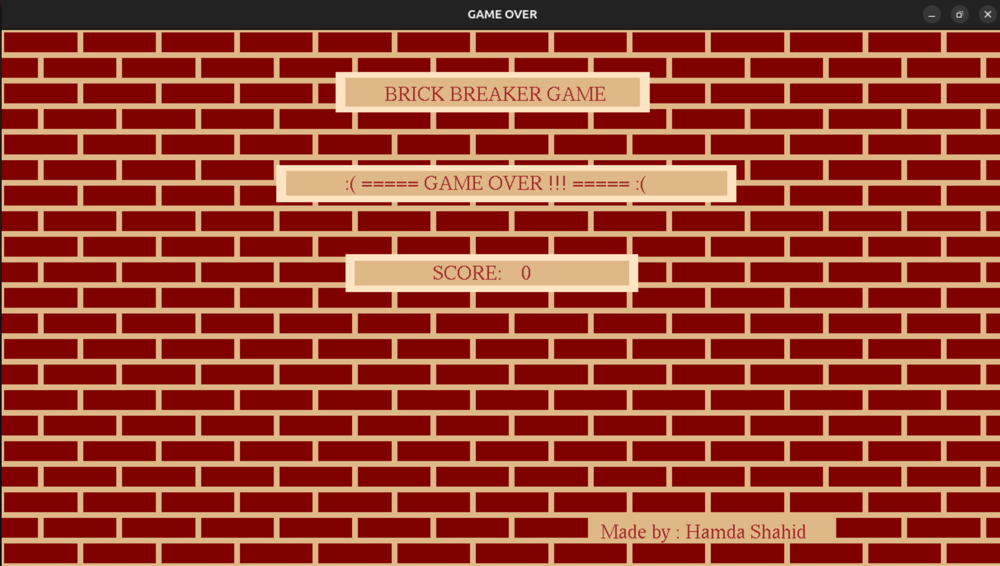

<!-- # Brick_Breaker_Game

<!--  -->
<!--
Arkadriod is a Brick Breaker game built with C++ and OpenGL, applying OOP principles like encapsulation and inheritance. Players control a paddle to bounce a ball, break bricks, and progress through challenging levels. The game includes power-ups, varied brick types, a scoring system, and high-score tracking.


## Features

- **Object-Oriented Design**: Utilizes encapsulation and inheritance for a modular and maintainable codebase.
- **Multiple Levels**: Progress through increasingly challenging levels.
<!-- - **Power-Ups**: Collect power-ups to enhance gameplay. 
- **Varied Brick Types**: Different bricks with unique properties.
- **Scoring System**: Keep track of your score and aim for the high score.
- **High-Score Tracking**: Records and displays the highest scores.

## Game Levels

Arkadriod consists of the following levels:

- **Menu**: Start the game, view high scores, or exit.
- **Level 1**: The introductory level to get you started.
- **Level 2**: A more challenging level with additional brick types.
- **Level 3**: The most difficult level with complex brick arrangements.
- **Game Over**: Displayed when you lose all your lives.

Each level increases in difficulty, providing a progressively challenging experience.




## Installation

1. Clone the repository:
   ```sh
   git clone https://github.com/hamdashahid/Brick_Breaker_Game.git
   ```
2. Navigate to the project directory:
   ```sh
   cd Brick_Breaker_Game
   ```
3. Compile the game using a C++ compiler:
   ```sh
   make
   ```
4. Run the game:
   ```sh
   ./game
   ```
## 🎮 How to Play

🕹️ **Controls**  
- 🖱️ **Move the paddle** using the **mouse**.  
- 🖱️ **Left-click** to launch the ball.  

🎯 **Gameplay**  
1️⃣ **Start the Game** – Click to release the ball from the paddle.  
2️⃣ **Control the Paddle** – Move your mouse to keep the ball in play.  
3️⃣ **Break the Bricks** – Aim to destroy all the bricks to clear the level.  
4️⃣ **Collect Power-ups** – Some bricks drop special power-ups; grab them for cool effects!  
5️⃣ **Avoid Missing the Ball** – If the ball falls below the paddle, you lose a life!  

🏆 **Goal:** Clear all levels by breaking every brick without losing all your lives!  

💡 **Pro Tip:** Use the paddle’s edges to change the ball’s direction and maximize control! 🚀  

<!--  

## Acknowledgements

- OpenGL for graphics rendering.
- GLUT for handling windowing and input.

Enjoy playing Arkadriod and aim for the highest score! 
-->


# 🎮 Brick Breaker Game

Welcome to **Brick Breaker Game**, a classic arcade-style game where you break bricks using a paddle and a bouncing ball! Can you beat all levels and become the ultimate champion? 🏆

<!--    -->

<!-- ## 🚀 Features
✅ **Multiple Levels** – Increasingly challenging levels to test your skills!  
🛡️ **Power-Ups** – Collect special items for extra abilities.

🎮 **How to Play?**

1️⃣ **Use Arrow Keys or Mouse** – Move the paddle left or right to control the ball.
2️⃣ **Break All Bricks** – Your goal is to break all the bricks without letting the ball fall.
3️⃣ **Catch Power-Ups** – Grab power-ups to get extra points, expand the paddle, or gain special abilities!
4️⃣ **Avoid Losing the Ball** – If the ball falls, you lose a life!

💡 **Pro Tip**: Use the paddle edges to angle the ball and aim your shots better! -->

---

## 🚀 Features
✅ **Multiple Challenging Levels** – Each level introduces new difficulties and surprises!
✅ **Exciting Power-Ups** – Speed boosts, multi-balls, bigger paddles, and more!
✅ **Classic Gameplay** – A modern twist on the legendary brick-breaking game.
✅ **Fun Graphics & Effects** – Enjoy an immersive retro gaming experience.

## 🛠 Installation

1. Clone the repository:
   ```sh
   git clone https://github.com/hamdashahid/Brick_Breaker_Game.git
   ```
2. Navigate to the project folder:
   ```sh
   cd Brick_Breaker_Game
   ```
3. Compile & Run (C++ or Python-based)
   - **For C++**:
     ```sh
    make
     ./game
     ```
   <!-- - **For Python** (if applicable):
     ```sh
     python main.py
     ``` -->
4. Enjoy playing! 🎾

---

## 📜 How to Play

1️⃣ **Use the Arrow Keys or Mouse** – Move the paddle left or right to control the ball.
2️⃣ **Hit the Ball** – Prevent the ball from falling by bouncing it off your paddle.
3️⃣ **Break the Bricks** – Aim and hit the ball to destroy all the bricks and clear each level.
4️⃣ **Catch Power-Ups** – Some bricks drop power-ups to help you play better.

💡 **Pro Tip:** Use the paddle’s edges to change the ball’s direction strategically!

## 🕹️ Controls
- **Left Arrow (←) / Right Arrow (→) or Mouse Movement** – Move the paddle left or right.
- **W (←) / R (→)** – Move the paddle left or right.
<!-- - **Spacebar / Click Mouse** – Launch the ball. -->

<!-- ## 📜 How to Play

1️⃣ **Launch the Ball** – Press **spacebar** or **left-click** to release the ball from the paddle.
2️⃣ **Move the Paddle** – Use the **arrow keys (← →) or the mouse** to move the paddle.
3️⃣ **Break All Bricks** – Hit the ball with the paddle to break all bricks on the screen.
4️⃣ **Catch Power-ups** – Some bricks release power-ups that help you win!
5️⃣ **Avoid Losing the Ball** – Keep the ball bouncing to prevent it from falling out of the screen. -->

## 🎯 Features
✔️ Multiple Levels – Increasing difficulty with new challenges!
✔️ Exciting Power-Ups – Grow your paddle, slow down time, and more!
✔️ Classic Gameplay – Enjoy the nostalgic fun of the original Brick Breaker with a modern touch.
✔️ Engaging Visuals – Beautifully designed levels with colorful bricks.

## 🎯 Objective

- Control the paddle to bounce the ball and break all the bricks.
- Complete all levels while scoring the highest points.
- Use power-ups strategically to survive and win.

## 🖥️ Screenshots

### Main Menu


### Level 1


### Level 2


### Level 3 – The Final Challenge!


## 📜 Credits
- **Developed by:** Hamda Shahid
- **Built with:** C++ / Python (Pygame)
- **Version:** 1.0

## 📌 Future Updates
- [ ] More levels with increasing difficulty.
- [ ] Different paddle skins and ball designs.
- **New power-ups and obstacles!**
- [Optional] Multiplayer mode!

### 🚀 Have Fun Breaking Bricks!

Enjoy the game, and let me know if you have any feedback or feature suggestions! 🚀🎮


## Copyright
© 2023 Hamda Shahid. All rights reserved.
